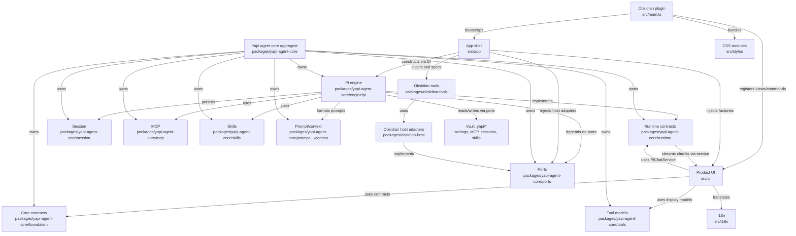
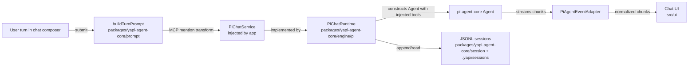
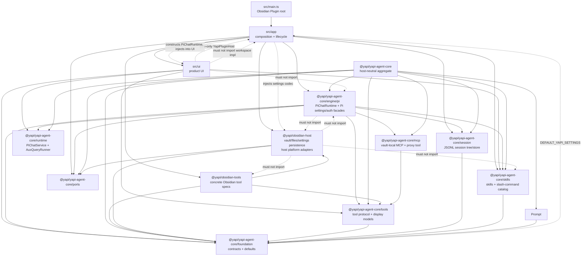

# YaPi architecture

Package and runtime maps for YaPi. Seam rules and invariants live in root
`AGENTS.md` (Architecture invariants); this file holds the diagrams.

## Composition and runtime ownership

## Turn flow

## Package dependency direction

`src/main.ts` and `src/app/` compose product semantics, while packages expose
narrower capabilities. `@yapi/obsidian-host` is host persistence/platform only
and implements `@yapi/yapi-agent-core/ports`; product settings defaults come from
`@yapi/yapi-agent-core/foundation`. The Pi engine must not import
`@yapi/obsidian-host` — host capabilities arrive through ports and app-layer DI.
Product UI must not construct `PiChatRuntime` or import `src/app/workspace/**`;
it receives `PiChatService` / `AuxQueryRunner` factories via the plugin host.

